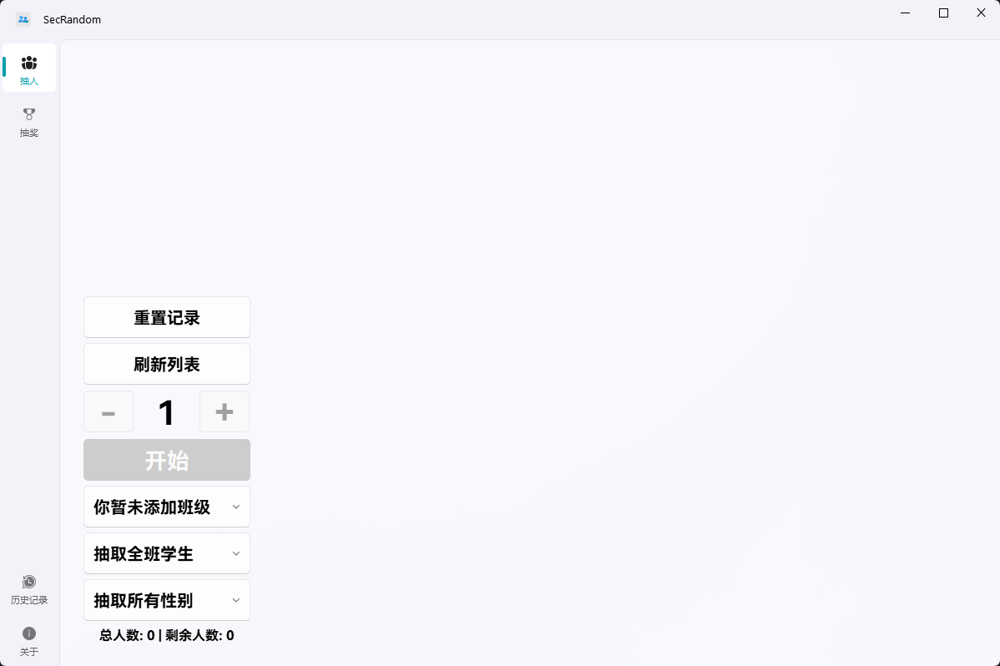
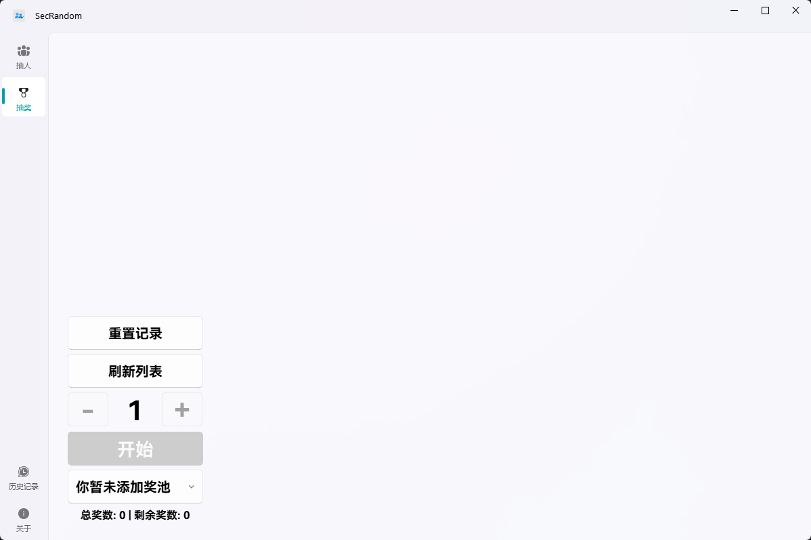
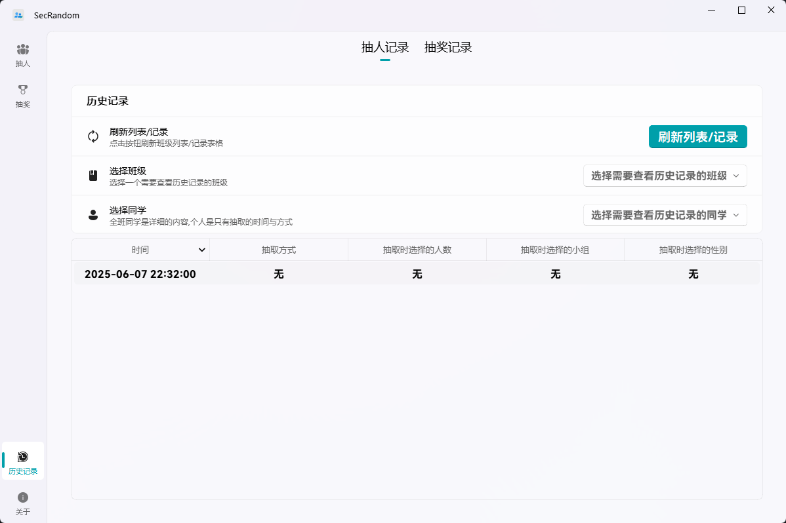
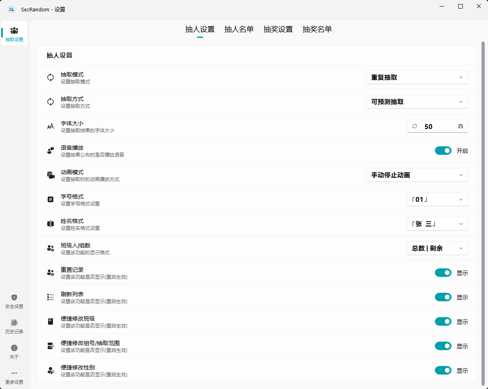

<image src="resources/SecRandom.png" height="128"/>

# SecRandom - 公平随机抽取系统

🚀 **现代化教育工具** | 🎯 **智能权重算法** | 🎨 **优雅交互体验**

<!-- 项目状态徽章 -->

> [!note]
> 
> SecRandom 本体将基于GNU GPLv3协议开源
> 
> GNU GPLv3具有Copyleft特性，也就是说，您可以修改SecRandom的源代码，但是**必须将修改版本同样以GNU GPLv3协议开源**

## 📖 目录
- [🌈 核心功能](#-核心功能)
- [📥 下载](#-下载)
- [💻 选择版本](#-选择版本)
- [📸 软件截图](#-软件截图)
- [📖 公平抽取](#-公平抽取)
- [🔌 插件开发](#-插件开发)
- [🙏 贡献者](#-贡献者和特别感谢)
- [💝 捐献支持](#-捐献支持)
- [📞 联系方式](#-联系方式)
- [📄 官方文档](#-文档)

## 🌈 核心功能

### 🛡️ 基础特性
- **跨平台支持**：完美兼容 Windows 7/10/11 系统
- **架构适配**：原生支持 x64 架构

### 💻 **适配系统**
- ✅ Windows 7 及以上版本操作系统
- ✅ x64, x86 架构

### 🎉 **功能**
- ✅ **抽单人/抽多人/抽小组/抽性别 等抽取方式**
- ✅ **结果语音提示功能**
- ✅ **可开关的历史记录**
- ✅ **带时间戳的详细抽取记录**
- ✅ **多名单管理**
- ✅ **独立抽取与设置界面**
- ✅ **便捷悬浮窗设计**
- ✅ **自动清除抽取记录**
- ✅ **抽取动态权重系统**
- ✅ **公平抽取的概率可视化**
- ✅ **抽取结果播报支持更多功能**
- ✅ **开机自启动支持**
- ✅ **现代化UI设计**

## 📥 下载

### 🌐 官方下载页面
- 📥 **[官方下载页面](https://secrandom.netlify.app/download)** - 获取最新稳定版本和测试版本

### 📦 下载源选择
- **GitHub 官方源** - 官方发布渠道，海外访问较快
- **GitHub 镜像源(ghfast.top)** - 国内加速镜像
- **GitHub 镜像源(gh-proxy.com)** - 国内加速镜像  
- **123云盘源** - 云盘下载，不限速

## 💻 选择版本

### 第一步：选择系统架构
- **x64**：适用于64位Windows系统（推荐）
- **x86**：适用于32位Windows系统

### 第二步：选择打包模式
- **目录模式**（文件名包含 `dir`）：
  - 体积相对较大
  - 支持重启功能
  - 支持x86、x64系统
  - 适合需要频繁重启或对启动速度有要求的用户

- **单文件模式**（文件名包含 `onefile`）：
  - 体积较小
  - 不支持重启功能
  - 仅支持x64系统
  - 只有一个可执行文件，便于携带
  - 适合对文件大小敏感或不需要重启功能的用户

### 第三步：下载对应文件
根据你的架构和模式选择，下载对应的 `.zip` 文件即可

### 第四步：解压文件
- 解压下载的 `.zip` 文件到任意目录
- 双击解压后的 `SecRandom.exe` 即可运行软件

## 📸 软件截图(v1.1.0.1)

📸 软件截图展示 ✨

## 📖 公平抽取

> [!note]
>
> **简介**:
> 公平抽取是一种随机抽取方式，它确保每个成员被抽取的权重由系统决定，从而避免不公平的结果。
> 这种方式适用于需要随机且公平的抽取学生回答问题或进行其他需要公平分配的场景。
> SecRandom的公平抽取的实现基于动态权重系统，通过多个方面来进行权重的计算。

### **动态权重**
> [!note]
>
> 动态权重是SecRandom的公平抽取的核心机制。
> 它通过以下几个方面来计算每个成员的权重：
> 1. 总抽取次数(被抽中次数越多权重越低)
> 2. 抽取各小组次数
> 3. 抽取各性别次数
> 4. 基础权重
> 5. 冷启动(防止新学生权重过低)

## 🔌 插件开发

🔌 插件开发指南

### 插件开发资源
- 插件开发示例：[插件开发示例](https://github.com/SECTL/SecRandom-plugins)
- 插件广场：[插件广场](https://github.com/SECTL/SecRandom-market)

### 开发支持
- 技术交流：[QQ群 833875216](https://qm.qq.com/q/iWcfaPHn7W)
- 问题反馈：[GitHub Issues](https://github.com/SECTL/SecRandom/issues)

## 🙏 贡献者和特别感谢

<!-- ALL-CONTRIBUTORS-LIST:START - Do not remove or modify this section -->
<!-- prettier-ignore-start -->
<!-- markdownlint-disable -->
<table>
  <tbody>
    <tr>
      <td align="center" valign="top" width="16.66%"><a href="https://github.com/lzy98276"> <b>lzy98276 (黎泽懿_Aionflux)</b></a> <a href="#content-lzy98276" title="Content">🖋</a> <a href="#design-lzy98276" title="Design">🎨</a> <a href="#ideas-lzy98276" title="Ideas, Planning, & Feedback">🤔</a> <a href="#maintenance-lzy98276" title="Maintenance">🚧</a> <a href="#doc-lzy98276" title="Documentation">📖</a> <a href="#bug-lzy98276" title="Bug reports">🐛</a></td>
      <td align="center" valign="top" width="16.66%"><a href="https://github.com/QiKeZhiCao"> <b>QiKeZhiCao (弃稞之草)</b></a> <a href="#ideas-QiKeZhiCao" title="Ideas, Planning, & Feedback">🤔</a> <a href="#maintenance-QiKeZhiCao" title="Maintenance">🚧</a></td>
      <td align="center" valign="top" width="16.66%"><a href="https://github.com/Fox-block-offcial"> <b>Fox-block-offcial</b></a> <a href="#bug-Fox-block-offcial" title="Bug reports">🐛</a> <a href="#testing-Fox-block-offcial" title="Testing">⚠️</a></td>
      <td align="center" valign="top" width="16.66%"><a href="https://github.com/yuanbenxin"> <b>yuanbenxin (本新同学)</b></a> <a href="#code-yuanbenxin" title="Code">💻</a> <a href="#design-yuanbenxin" title="Design">🎨</a> <a href="#maintenance-yuanbenxin" title="Maintenance">🚧</a> <a href="#doc-yuanbenxin" title="Documentation">📖</a></td>
      <td align="center" valign="top" width="16.66%"><a href="https://github.com/zhangjianjian7"> <b>zhangjianjian7 (叶背影)</b></a> <a href="#doc-zhangjianjian7" title="Documentation">📖</a></td>
      <td align="center" valign="top" width="16.66%"><a href="https://github.com/jursin"> <b>Jursin</b></a> <a href="#code-jursin" title="Code">💻</a> <a href="#design-jursin" title="Design">🎨</a> <a href="#maintenance-jursin" title="Maintenance">🚧</a> <a href="#doc-jursin" title="Documentation">📖</a></td>
    </tr>
  </tbody>
</table>

## 💝 捐献支持

如果您觉得 SecRandom 对您有帮助，欢迎支持我们的开发工作！

- **支付宝/微信支付**

  <image src="app/resource/assets/contribution/Alipay.png" height="196"/> <image src="app/resource/assets/contribution/WeChat_Pay.png" height="196"/>

## 📞 联系方式

* 📧 [邮箱](mailto:lzy.12@foxmail.com)
* 👥 [QQ群 833875216](https://qm.qq.com/q/iWcfaPHn7W)
* 🎥 [B站主页](https://space.bilibili.com/520571577)
* 🐛 [问题反馈](https://github.com/SECTL/SecRandom/issues)

## 📄 文档

- 📄 **[SecRandom 官方文档](https://secrandom.netlify.app)**
  - 
- 

## 🏆 贡献值

>[!TIP]
>
> 📊 **贡献值计算公式**：贡献值 = （提出PR×3分） + （提交×2分） + （文档×5分） + （处理Issue×5分）
> 
> 📅 **统计时间范围**：2025.08.01 - 2026.01.31 (中国时间 UTC+8)
> 
> 🏗️ **统计仓库**：SECTL/SecRandom, SECTL/SecRandom-docs

## ✨ Star历程

<picture>
  <source media="(prefers-color-scheme: dark)" srcset="https://api.star-history.com/svg?repos=SECTL/SecRandom&type=Date&theme=dark">
  
</picture>

**Copyright © 2025 SECTL**
