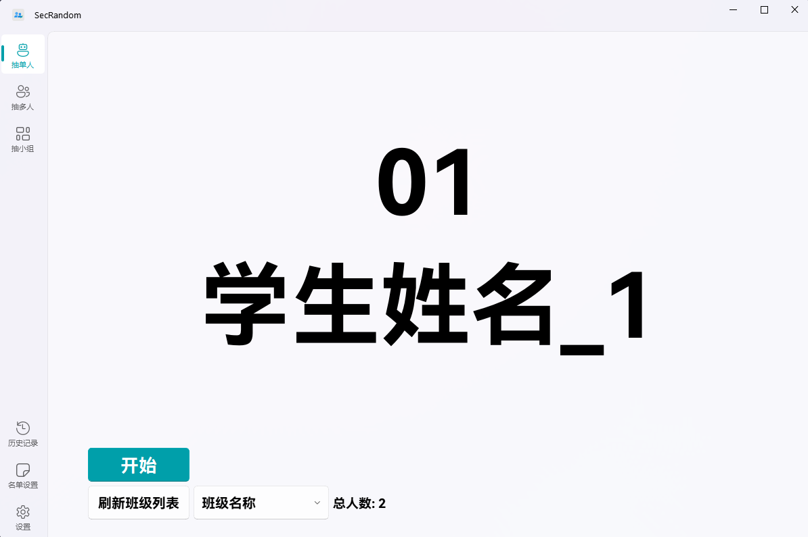
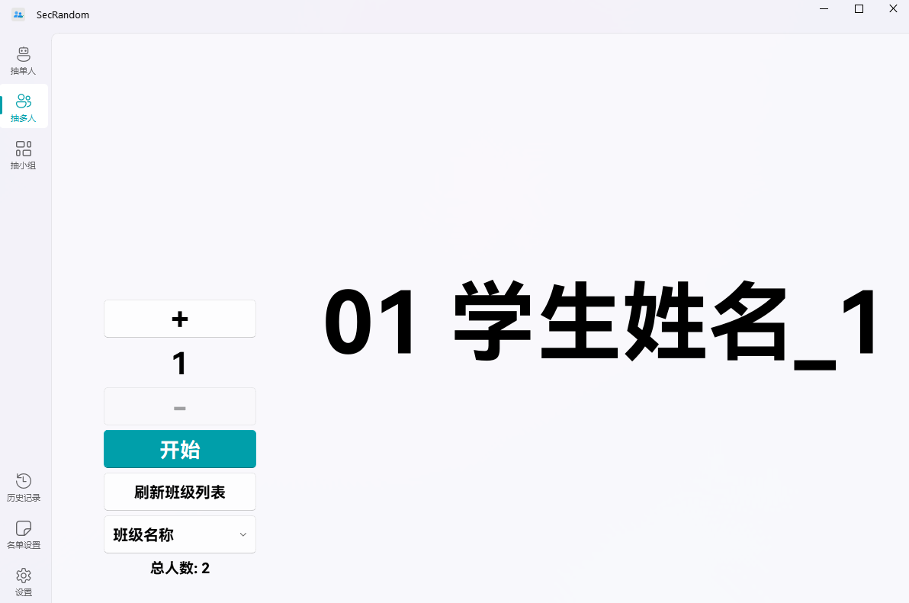

<image src="resources/SecRandom.png" height="128"/>

# SecRandom

该软件能以多种方式进行完全公平的随机抽取 抽单人/抽多人/抽小组/抽性别...

| [Github(镜像) 下载](https://github.com/SECTL/SecRandom/releases) | [123云盘 下载](https://www.123684.com/s/9529jv-U4Fxh) |

<!-- [切换语言](javascript:void(0)) | [English](README_ALL/readme_en.md) | [白露版(仅供娱乐)](README_ALL/readme_bailu.md) -->

> [!note]
> 
> SecRandom本体将基于GNU GPLv3协议开源
> 
> GNU GPLv3具有Copyleft特性，也就是说，您可以修改SecRandom的源代码，但是**必须将修改版本同样以GNU GPLv3协议开源**

> [!warning]
> 
> **SecRandom v1.0.3.0-beta 版本起存储名单采用json格式，更新至此版本需要重新添加名单(建议不替换文件进行安装-删了旧版重新弄)**

## 💻 适配系统
- ✅ Windows 7 及以上版本操作系统
- ✅ 32 位、64 位

## 🎉 功能

- ✅ **抽单人/抽多人/抽小组/抽性别 等抽取方式**
- ✅ **结果语音提示功能**
- ✅ **可开关的历史记录**
- ✅ **带时间戳的详细抽取记录**
- ✅ **多班级名单管理**
- ✅ **独立抽取与设置界面**
- ✅ **便捷悬浮窗设计**
- ✅ **开机自启动支持**
- ✅ **现代化UI设计**

- ❌ **开发计划中去除 权重 功能**(在1.1Dev版本开发计划去除)

## ⭐️ 快速开始

### 📥 下载与安装
1. 下载对应版本压缩包
2. 解压到合适目录（如D:\）
3. 运行SecRandom.exe
4. 长按托盘图标进行设置
5. 开始使用

### 🔧 软件设置
**名单设置**
1. 进入设置界面 > 名单设置
2. 添加新班级
3. 配置班级成员及分组

**全局设置**
1. 设置抽取模式
2. 调整语音提示
3. 自定义显示动画

## 📖 公平抽取
> [!note]
> 
> 简介:
> 公平抽取是一种随机抽取方式，它确保每个成员被抽取的权重由系统决定，从而避免不公平的结果。
> 这种方式适用于需要随机且公平的抽取学生回答问题或进行其他需要公平分配的场景。
> SecRandom的公平抽取的实现基于动态权重系统，通过多个方面来进行权重的计算。

### 动态权重
> [!note]
>
> 动态权重是SecRandom的公平抽取的核心机制。
> 它通过以下几个方面来计算每个成员的权重：
> 1. 总抽取次数(被抽中次数越多权重越低)
> 2. 抽取各小组次数
> 3. 抽取各性别次数
> 4. 基础权重
> 5. 冷启动(防止新学生权重过低)

## 📌 软件截图
| 浅色-抽单人 | 浅色-抽多人 |
|-------------|-------------|
|  |  |

## 📮 联系方式
* 📧 [邮箱](mailto:lzy.12@foxmail.com)
* 👥 [QQ群 833875216](https://qm.qq.com/q/iWcfaPHn7W)
* 🎥 [B站主页](https://space.bilibili.com/520571577)

## ✨ Star历程
<picture>
  <source media="(prefers-color-scheme: dark)" srcset="https://api.star-history.com/svg?repos=SECTL/SecRandom&type=Date&theme=dark">
  
</picture>

**Copyright © 2025 lzy98276**
