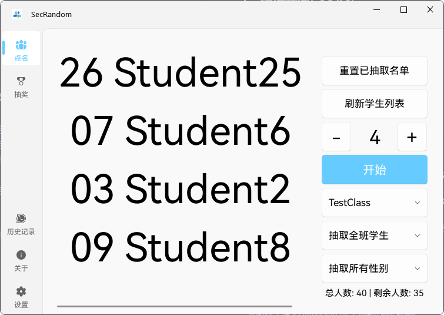
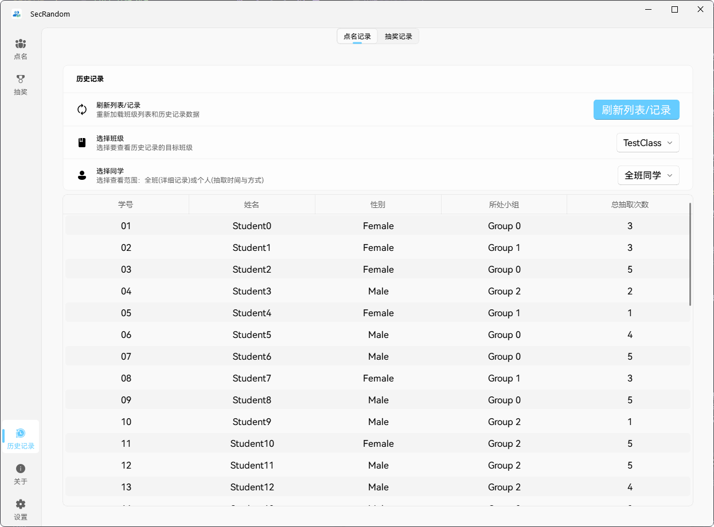
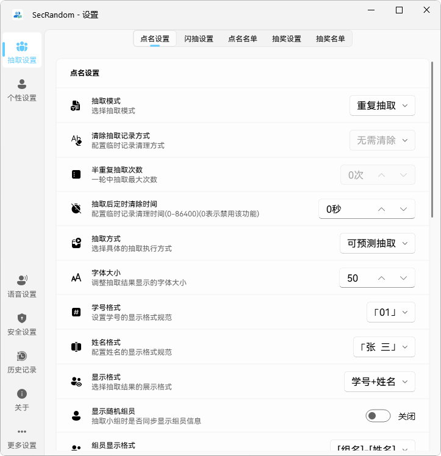

<div align="center">

<image src="../resources/secrandom-icon-paper.png" height="128"/>

# SecRandom - Fair Random Selection System

🎯 **Truly Fair Random Selection Algorithm** | 🚀 **Modern Educational Tools** | 🎨 **Elegant Interactive Experience**

> The Readme you are currently reading is **translated by AI** and reviewed by our developers. If you find any errors, please report it.
</div>

<!-- Project Status Badges -->
<div align="center">

[](https://github.com/SECTL/SecRandom/issues)
[](https://github.com/SECTL/SecRandom/releases/latest)
[](https://github.com/SECTL/SecRandom/releases/)
[](https://github.com/SECTL/SecRandom/commits/master)
[](https://github.com/SECTL/SecRandom/releases)

[](https://qm.qq.com/q/iWcfaPHn7W)
[](https://space.bilibili.com/520571577)
[](https://opensource.org/licenses/GPL-3.0)

[简体中文](../README.md) | **✔English** | [繁體中文](./README_ZH_TW.md)
</div>

<div align="center">


</div>

> [!NOTE]
>
> SecRandom will be open source under the GNU GPLv3 license
>
> GNU GPLv3 has Copyleft characteristics, which means you can modify the source code of SecRandom, but **must also open source the modified version under the GNU GPLv3 license**
---------
> [!NOTE]
>
> **SecRandom v2** will be released around 2025/12/14 (GMT +8:00 China Standard Time)!
>
> Please follow our BiliBili / QQ Channel for regular development progress updates!

## 📖 Table of Contents

- [🎯 Why Choose Fair Selection](#-why-choose-fair-selection)
- [🌟 Core Features](#-core-features)
- [📥 Download](#-download)
- [📸 Software Screenshots](#-software-screenshots)
- [🙏 Contributors and Special Thanks](#-contributors-and-special-thanks)
- [💝 Support Us](#-support-us)
- [📞 Contact](#-contact)
- [📄 Official Documentation](#-official-documentation)
- [✨ Star History](#-star-history)
- [📖 GitHub Contribution Tutorial](#-github-contribution-tutorial)
- [📖 Usage Tutorial](#-usage-tutorial)

## 🎯 Why Choose Fair Selection

Traditional random selection often has the problem of "repeatedly selecting certain people while others are rarely selected". SecRandom uses an **intelligent dynamic weight algorithm** to ensure every member gets a fair chance of being selected:

- **Avoid Repeated Selection**: The more times someone is selected, the lower their probability of being selected again
- **Balance Group Opportunities**: Ensure members from different groups have equal selection opportunities
- **Gender Balance Consideration**: Balance selection frequency of different genders during the selection process
- **Cold Start Protection**: New members or those who haven't been selected for a long time won't lose opportunities due to low weight
- **Probability Visualization**: Real-time display of each member's selection probability, making the process transparent and trustworthy

## 🌟 Core Features

### 🎯 Intelligent Fair Selection System

- ✅ **Dynamic Weighting Algorithm**: Calculates based on multiple dimensions including selection count, group, and gender to ensure true fairness
- ✅ **Cold Start Protection**: Prevents new members from having too low weight, ensuring everyone has equal opportunities
- ✅ **Probability Visualization**: Intuitively displays each member's probability of being selected, making the selection process transparent

### 🎨 Modern User Experience

- ✅ **Elegant UI Design**: Modern interface based on Fluent Design, supporting light/dark themes
- ✅ **Floating Window Mode**: Perform selections anytime without affecting other work
- ✅ **Voice Announcements**: Automatic voice announcement of selection results, supporting custom voice engines

### 🚀 Powerful Feature Set

- ✅ **Multiple Selection Modes**: Individual/multiple/group/gender selection to meet different scenario needs
- ✅ **Smart History Records**: Detailed records with timestamps, supporting automatic cleanup
- ✅ **Multi-list Management**: Support for importing/exporting lists, easily managing different classes/teams

### 💻 System Compatibility

- ✅ **Full Platform Support**: Perfectly compatible with Windows 7/10/11 systems and Linux systems
- ✅ **Multi-architecture Support**: Native support for x64 and x86 architectures
- ✅ **Startup on Boot**: Supports automatic startup on boot, always available (Windows)

## 📥 Download

### 🌐 Official Download Page

- 📥 **[Official Download Page](https://secrandom.netlify.app/download)** - Get the latest stable version and beta versions

## 📸 Software Screenshots

<details>
<summary>📸 Software Screenshots Display ✨</summary>






</details>

## 🙏 Contributors and Special Thanks

<!-- ALL-CONTRIBUTORS-LIST:START - Do not remove or modify this section -->
<!-- prettier-ignore-start -->
<!-- markdownlint-disable -->
<table>
  <tbody>
    <tr>
      <td align="center" valign="top" width="11.11%"><a href="https://github.com/lzy98276"><br /><sub><b>lzy98276 (黎泽懿_Aionflux)</b></sub></a><br /><a href="#content-lzy98276" title="Content">🖋</a> <a href="#design-lzy98276" title="Design">🎨</a> <a href="#ideas-lzy98276" title="Ideas, Planning, & Feedback">🤔</a> <a href="#maintenance-lzy98276" title="Maintenance">🚧</a> <a href="#doc-lzy98276" title="Documentation">📖</a> <a href="#bug-lzy98276" title="Bug reports">🐛</a></td>
      <td align="center" valign="top" width="11.11%"><a href="https://github.com/chenjintang-shrimp"><br /><sub><b>chenjintang-shrimp</b></sub></a><br /><a href="#code-chenjintang-shrimp" title="Code">💻</a></td>
      <td align="center" valign="top" width="11.11%"><a href="https://github.com/yuanbenxin"><br /><sub><b>yuanbenxin (本新同学)</b></sub></a><br /><a href="#code-yuanbenxin" title="Code">💻</a> <a href="#design-yuanbenxin" title="Design">🎨</a> <a href="#maintenance-yuanbenxin" title="Maintenance">🚧</a> <a href="#doc-yuanbenxin" title="Documentation">📖</a></td>
      <td align="center" valign="top" width="11.11%"><a href="https://github.com/LeafS825"><br /><sub><b>LeafS</b></sub></a><br /><a href="#doc-LeafS" title="Documentation">📖</a></td>
      <td align="center" valign="top" width="11.11%"><a href="https://github.com/QiKeZhiCao"><br /><sub><b>QiKeZhiCao (弃稞之草)</b></sub></a><br /><a href="#ideas-QiKeZhiCao" title="Ideas, Planning, & Feedback">🤔</a> <a href="#maintenance-QiKeZhiCao" title="Maintenance">🚧</a></td>
      <td align="center" valign="top" width="11.11%"><a href="https://github.com/Fox-block-offcial"><br /><sub><b>Fox-block-offcial</b></sub></a><br /><a href="#bug-Fox-block-offcial" title="Bug reports">🐛</a> <a href="#testing-Fox-block-offcial" title="Testing">⚠️</a></td>
      <td align="center" valign="top" width="11.11%"><a href="https://github.com/jursin"><br /><sub><b>Jursin</b></sub></a><br /><a href="#code-jursin" title="Code">💻</a> <a href="#design-jursin" title="Design">🎨</a> <a href="#maintenance-jursin" title="Maintenance">🚧</a> <a href="#doc-jursin" title="Documentation">📖</a></td>
      <td align="center" valign="top" width="11.11%"><a href="https://github.com/LHGS-github"><br /><sub><b>LHGS-github</b></sub></a><br /><a href="#doc-LHGS-github" title="Documentation">📖</a></td>
      <td align="center" valign="top" width="11.11%"><a href="https://github.com/real01bit"><br /><sub><b>real01bit</b></sub></a><br /><a href="#code-real01bit" title="Code">💻</a></td>
    </tr>
  </tbody>
</table>

## 💝 Support Us

If you find SecRandom helpful, you're welcome to support our development work!

### Afdian Support

> [!CAUTION]
> **Afdian is a Chinese-based donation platform.** You may not use Afdian out of mainland China.

- 🌟 **[Afdian Support Link](https://afdian.com/a/lzy0983)** - Support developers through the Afdian platform

## 📞 Contact

* 📧 [Email](mailto:lzy.12@foxmail.com)
* 👥 [QQ Group 833875216](https://qm.qq.com/q/iWcfaPHn7W)
* 💬 [QQ Channel](https://pd.qq.com/s/4x5dafd34?b=9)
* 🎥 [Bilibili Homepage](https://space.bilibili.com/520571577)
* 🐛 [Issue Report](https://github.com/SECTL/SecRandom/issues)

## 📄 Official Documentation

- 📄 **[SecRandom Official Documentation](https://secrandom.netlify.app)**
- [](https://deepwiki.com/SECTL/SecRandom)

## ✨ Star History

<picture>
  <source media="(prefers-color-scheme: dark)" srcset="https://api.star-history.com/svg?repos=SECTL/SecRandom&type=Date&theme=dark">
  
</picture>

## 📖 GitHub Contribution Tutorial

<details>
<summary>Click to view details</summary>

### 🚀 Quick Start

Before contributing code to the SecRandom project, please ensure you have completed the following preparations:

1. **Fork the Project**
   - Visit [SecRandom GitHub Repository](https://github.com/SECTL/SecRandom)
   - Click the "Fork" button in the upper right corner to create your own repository copy

2. **Clone the Repository**
   ```bash
   git clone https://github.com/YourUsername/SecRandom.git
   cd SecRandom
   ```

3. **Add Upstream Repository**
   ```bash
   git remote add upstream https://github.com/SECTL/SecRandom.git
   ```

### 📤 Submit Your Contribution

1. **Create a Feature Branch**
   ```bash
   git checkout -b feature/YourFeatureName
   ```

2. **Make Changes**
   - Write your code
   - Add necessary comments (please use Chinese)
   - Ensure following the project's code standards

3. **Commit Changes**
   ```bash
   git add .
   git commit -m "Describe your changes"
   ```

4. **Sync Upstream Changes**
   ```bash
   git fetch upstream
   git rebase upstream/master
   ```

5. **Push and Create Pull Request**
   ```bash
   git push origin feature/YourFeatureName
   ```
   - Visit your GitHub repository
   - Click the "Compare & pull request" button
   - Fill in the PR description and submit

### 📋 Contribution Guidelines

#### Code Standards
- Use Chinese for code comments
- Follow the project's existing code style
- Ensure all used Qt classes are imported
- Verify third-party UI components exist

#### Commit Message Standards
- Use clear, concise commit messages
- Start with a verb (e.g., Add, Fix, Update, etc.)
- Avoid overly simple descriptions (e.g., "fix bug")

#### Pull Request Requirements
- PR title should clearly and concisely describe the changes
- Provide detailed change descriptions
- Ensure all tests pass
- Link related Issues (if any)

</details>

## 📖 Usage Tutorial

### 🚀 GitHub Actions Unified Build Workflow Usage Guide

The SecRandom project uses a unified GitHub Actions workflow for building and publishing, located at `.github/workflows/build-unified.yml`. This workflow supports multiple trigger methods and configuration options.

<details>
<summary>View more information</summary>

#### Triggering Specific Builds Through Commit Messages

You can trigger different build behaviors by including specific keywords in your git commit message:

1. **Trigger Package Build**
   - Include the `打包` (package) keyword in the commit message
   - For example: `git commit -m "New feature 打包"`

2. **Specify Build Platform**
   - `win` - Windows platform
   - `linux` - Linux platform
   - `all` - All platforms
   - For example: `git commit -m "Fix bug 打包 linux"`

3. **Trigger All Platform Builds**
   - Create a tag that follows version number format (format: `v数字.数字.数字.数字`)
   - For example: `git tag v1.2.3.4 && git push origin v1.2.3.4`

#### Build Parameter Keyword Description

The commit message can contain the following keywords to control build behavior:

| Keyword | Meaning | Example |
|---------|--------|--------|
| `打包` | General package trigger | `git commit -m "New feature 打包"` |
| `win` | Windows platform | `git commit -m "Fix UI 打包 win"` |
| `linux` | Linux platform | `git commit -m "Optimize performance 打包 linux"` |
| `all` | All platforms | `git commit -m "Major update 打包 all"` |

**Combination Usage Examples:**
- `git commit -m "Optimize performance 打包 pi"` - Use PyInstaller to build Windows platform
- `git commit -m "Fix bug 打包 pi"` - Use PyInstaller to build Linux platform

</details>

**Copyright © 2025 SECTL**